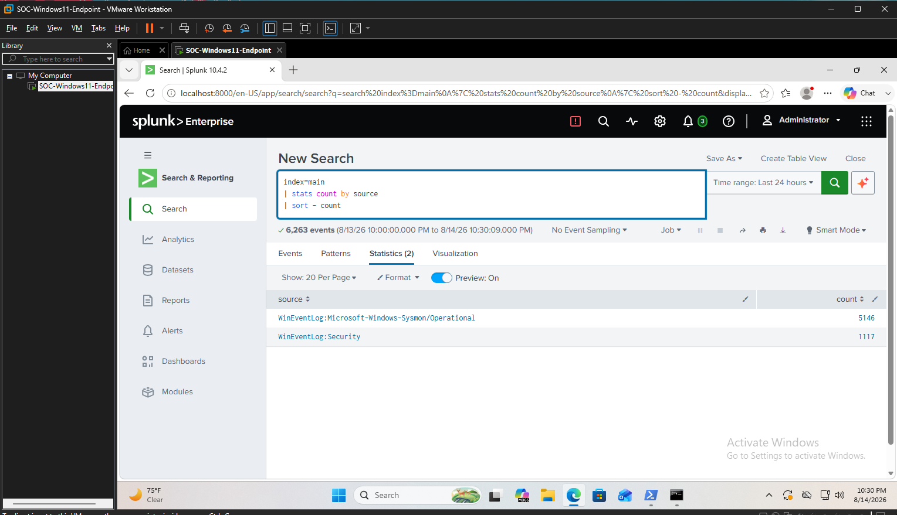
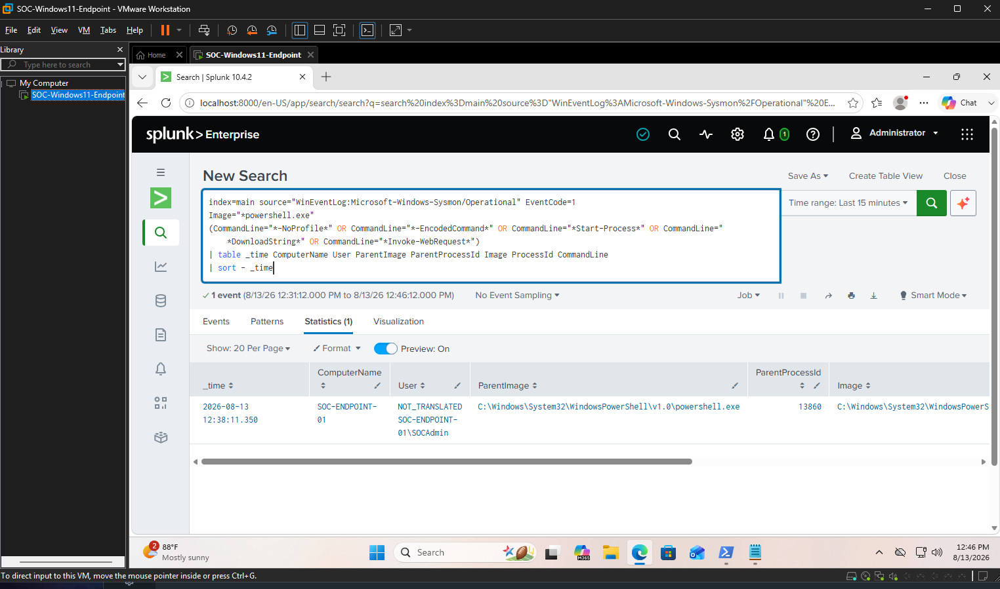
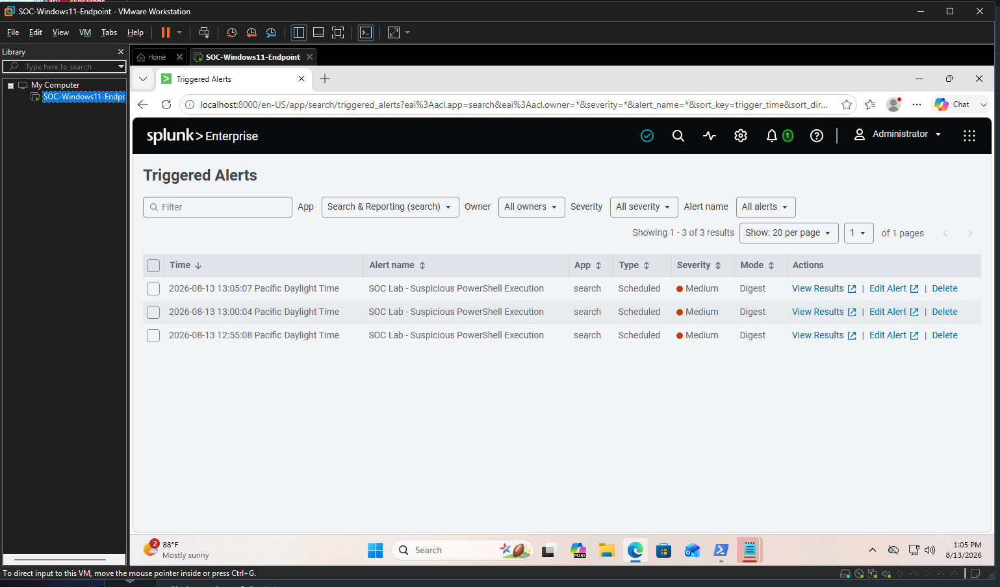
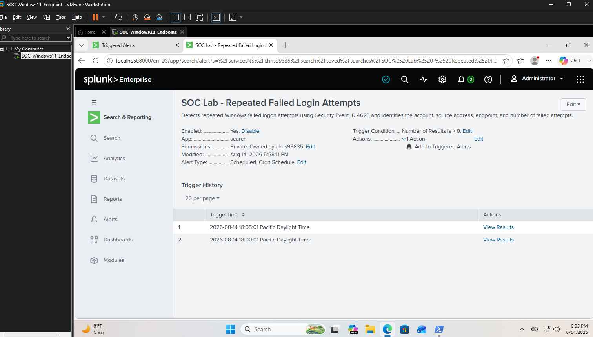
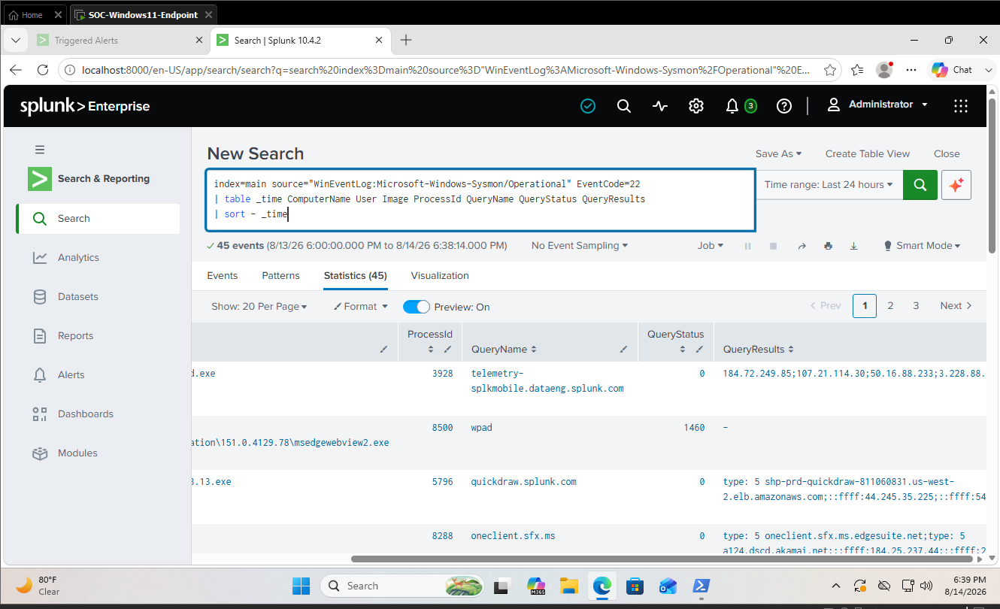

# SOC Detection & Investigation Home Lab

## Overview

This project documents a hands-on Security Operations Center (SOC) home lab built to practice endpoint monitoring, log analysis, threat detection, investigation, and alerting.

I configured a Windows 11 virtual machine as a monitored endpoint, deployed Sysmon for enhanced endpoint telemetry, and ingested Sysmon and Windows Security logs into Splunk Enterprise.

Using Splunk Search Processing Language (SPL), I investigated Windows activity, analyzed authentication failures, examined process execution and parent-child relationships, reviewed DNS and file activity, and created automated alerts for suspicious behavior.

## Lab Environment

- Windows 11
- VMware Workstation
- Splunk Enterprise
- Sysmon
- Windows Security Event Logs
- PowerShell
- Splunk Processing Language (SPL)

## Skills Demonstrated

- SIEM log ingestion and analysis
- Windows endpoint monitoring
- Sysmon event analysis
- SPL query development
- Process and parent-child process investigation
- Windows authentication failure analysis
- DNS activity investigation
- File creation monitoring
- Registry activity investigation
- Detection engineering
- Automated alert creation
- SOC investigation workflow

## Data Sources

The lab ingested two primary Windows log sources into Splunk:

- `WinEventLog:Microsoft-Windows-Sysmon/Operational`
- `WinEventLog:Security`

These logs provided visibility into endpoint behavior and Windows authentication/security activity.
## Log Ingestion & Visibility

Splunk Enterprise was configured to ingest telemetry from both Sysmon and the Windows Security event log. This provided centralized visibility into endpoint activity and authentication events from the Windows 11 endpoint.

During validation, Splunk successfully returned:

- 5,146 Sysmon events
- 1,117 Windows Security events
- 6,263 total events within the selected 24-hour search window

This confirmed that both primary data sources were successfully being collected and searchable within the SIEM.

### Evidence

The screenshot below demonstrates successful ingestion of both Sysmon and Windows Security telemetry into Splunk.



## Detection 1: Suspicious PowerShell Activity

### Objective

Identify and investigate potentially suspicious PowerShell execution using Sysmon process creation telemetry.

### Investigation

I used Sysmon Event ID 1 data in Splunk to analyze PowerShell process execution. The investigation focused on process details such as the executing user, process image, command line, process ID, and parent process information.

This demonstrated how endpoint process telemetry can be used during SOC triage to identify and investigate potentially suspicious command-line activity.

### Detection Logic

```spl
index=main source="WinEventLog:Microsoft-Windows-Sysmon/Operational" EventCode=1 Image="*powershell.exe"
``` 
### Detection Evidence

The SPL detection successfully identified PowerShell activity matching the suspicious command-line criteria.



### Automated Alert

After validating the detection logic, I converted the SPL search into a scheduled Splunk alert. The alert was configured to trigger when matching suspicious activity was detected.

I then generated controlled test activity and verified that Splunk successfully triggered the alert. This demonstrated the complete detection workflow from endpoint telemetry collection to automated SOC alerting.
### Alert Evidence

The triggered alert confirmed that the detection was operational and could automatically surface matching activity for analyst review.



## Detection 2: Repeated Failed Login Attempts

### Objective

Detect repeated Windows authentication failures that could indicate password guessing, brute-force activity, or unauthorized access attempts.

### Investigation

I analyzed Windows Security logs in Splunk using Event ID 4625, which records failed logon attempts. The investigation focused on identifying the affected account, source address, endpoint, and number of authentication failures.

By aggregating failed logon events, I was able to identify repeated authentication failures and create detection logic that could automatically alert an analyst when this activity occurred.

### Detection Logic

```spl
index=main source="WinEventLog:Security" EventCode=4625
| stats count by Account_Name Source_Network_Address ComputerName
| sort - count
```

### Result

The detection provides visibility into repeated failed authentication attempts and can help SOC analysts identify accounts or systems experiencing suspicious login activity.
### Alerting

I converted the detection into a scheduled Splunk alert that automatically checks for repeated failed-login activity. The alert was configured to run every 5 minutes and review the previous 60 minutes of Windows Security logs.

### Detection Evidence

The alert successfully triggered during testing, confirming that the failed-login detection and automated alerting workflow were functioning correctly.



---

## Detection 3: DNS Activity Investigation

### Objective

Investigate DNS activity from the Windows endpoint to identify unusual domain lookups and determine which processes generated the requests.

### Investigation

I analyzed Sysmon Event ID 22 telemetry in Splunk to examine DNS queries generated by processes running on the endpoint.

The investigation focused on the queried domain, process image, process ID, query status, and returned DNS results. This type of analysis can help identify suspicious domains, command-and-control activity, or unexpected network behavior.

### Detection Logic

```spl
index=main source="WinEventLog:Microsoft-Windows-Sysmon/Operational" EventCode=22
| table _time ComputerName User Image ProcessId QueryName QueryStatus QueryResults
| sort - _time
```

### Result

Splunk successfully returned DNS telemetry from the monitored endpoint, allowing DNS requests to be correlated with the processes responsible for generating them.

### Investigation Evidence

Splunk returned 45 DNS events during the investigation, providing visibility into DNS queries, their results, and the processes responsible for generating them.


